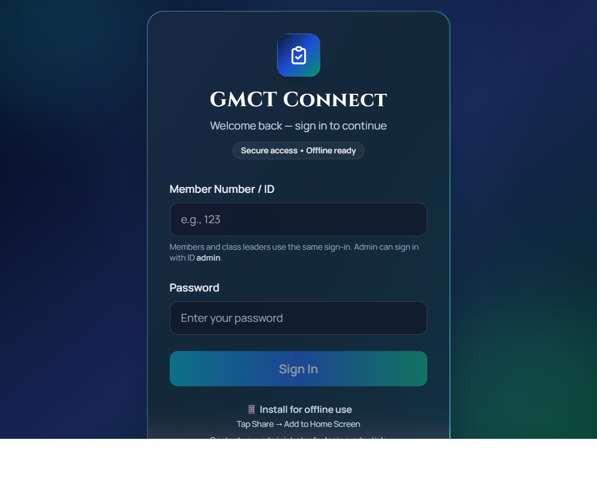
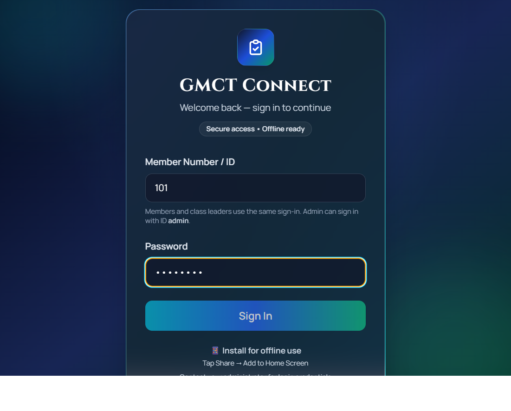
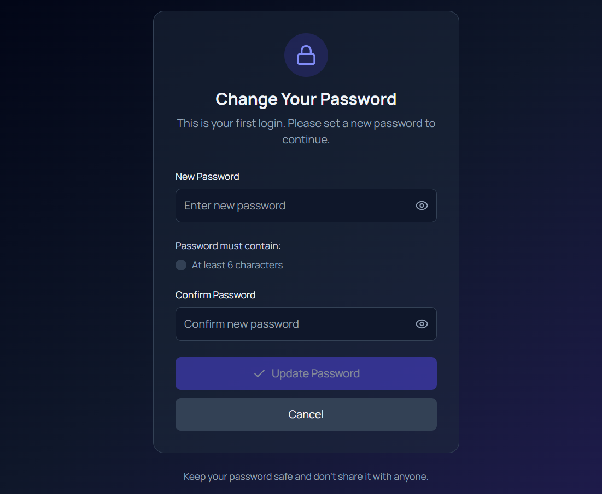
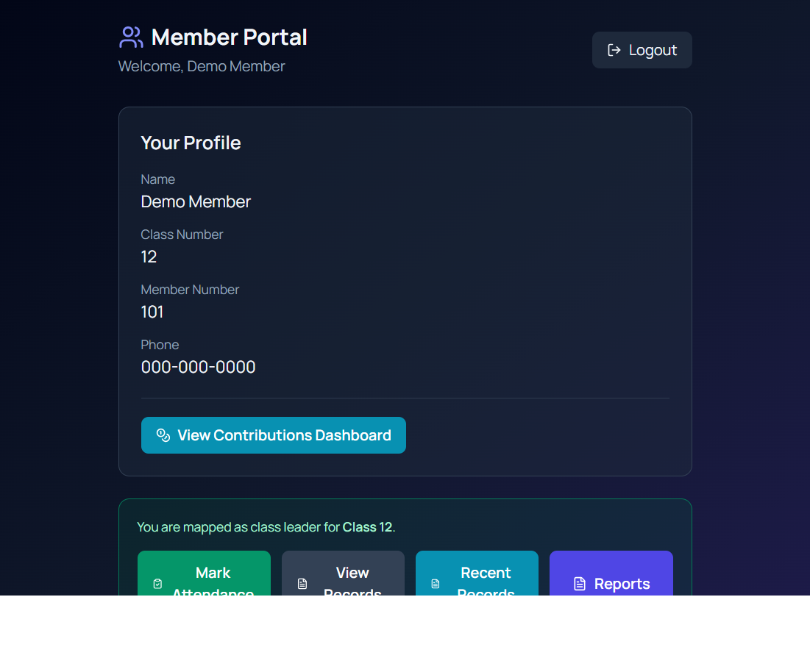
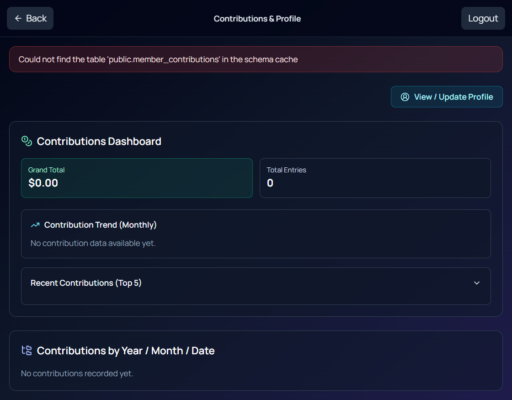

# GMCT Connect Video Guide

Use this as a simple read-aloud script for members.

## App Screenshots

### Login Screen

### Login Screen With Example Details

### Password Change Screen

### Member Portal Example

### Contributions Dashboard Example

Note:
The member portal image is a representative demo screen.

## What Members Need To Know First

- There is no self-service sign-up page in the app.
- An admin must add the member first.
- Members sign in with their member number or ID.
- The default first-time password is gmct2026.
- On first login, the app asks the member to set a new password.
- The new password must be at least 6 characters.

## Short Video Version

"Welcome to GMCT Connect. This video will show you how to start using the app for the first time.

First, please note that you do not create your own account inside the app. Your church admin or class leader must add you first.

When your account is ready, you will receive your member number or member ID. That member number or ID is your username.

Your first default password is gmct2026.

To sign in, open GMCT Connect. In the first box, enter your member number or ID. In the second box, enter the default password gmct2026. Then tap Sign In.

If this is your first login, the app will ask you to change your password. Type your new password, confirm it, and tap Update Password. Your new password must be at least 6 characters.

After that, you can continue using the app. If you are a regular member, you will see your member area. If you are a class leader, you may also see options like Mark Attendance, Edit Attendance, or View Recent.

To make the app easier to open, you can add it to your phone home screen. On iPhone, open the app in Safari, tap the Share button, then choose Add to Home Screen, and tap Add. On Android, open the app in Chrome, tap the three-dot menu, choose Add to Home Screen, and tap Add.

If your login does not work, please contact the church admin to confirm that your member account has been added and activated."

## Slower Step-By-Step Version

### Scene 1: Introduction

"This is a quick guide on how to start using GMCT Connect on your phone."

### Scene 2: Explain Sign-Up

"Before you can use the app, an admin must first add your account. There is no sign-up button for members inside the app. If you have not received your member number or ID yet, please contact your church admin."

### Scene 3: Show Login Screen

"When the app opens, you will see the login page. In the Member Number or ID box, enter the member number or ID given to you. In the Password box, enter your default password, which is gmct2026. Then tap Sign In."

### Scene 4: First Password Change

"The first time you log in, the app will ask you to change your password. Enter a new password, enter it again to confirm, and tap Update Password. Make sure your password has at least 6 characters. Keep your new password safe."

### Scene 5: After Login

"After signing in, you can start using the app. Some users will see their member dashboard. Class leaders may also see attendance options such as Mark Attendance, Edit Attendance, and View Recent."

### Scene 6: Add To Home Screen On iPhone

"If you use an iPhone, open the app in Safari. Tap the Share button at the bottom or top of the screen. Scroll down and tap Add to Home Screen. Then tap Add. The app will now appear on your home screen like a normal app."

### Scene 7: Add To Home Screen On Android

"If you use an Android phone, open the app in Chrome. Tap the three dots in the top-right corner. Tap Add to Home Screen. Then tap Add to confirm. The app icon will appear on your home screen."

### Scene 8: Support Message

"If you cannot sign in, or if you do not know your member number or ID, please contact the church admin for help."

## Suggested Screenshot Order

1. Login screen with empty fields.
2. Login screen with example member number filled in.
3. First-time change password screen.
4. Member dashboard or class leader home screen.
5. iPhone Share menu showing Add to Home Screen.
6. Android Chrome menu showing Add to Home Screen.

## Verified App Copy

- Login label: Member Number / ID
- Login helper text: Members and class leaders use the same sign-in. Admin can sign in with ID admin.
- First-time password heading: Change Your Password
- First-time password message: This is your first login. Please set a new password to continue.
- Password rule: At least 6 characters

## 60-Second Video Version

"This is how to start using GMCT Connect.

First, please note that members do not sign up by themselves in the app. Your church admin must add you first.

When your account is ready, use your member number or ID as your username.

Your default first password is gmct2026.

Open the app, enter your member number or ID, enter gmct2026 as the password, and tap Sign In.

The first time you log in, you will be asked to set a new password. Enter your new password, confirm it, and tap Update Password. Your new password must be at least 6 characters.

After that, you can use the app normally.

If you use an iPhone, open the app in Safari, tap Share, then Add to Home Screen.

If you use Android, open the app in Chrome, tap the three dots, then Add to Home Screen.

If you cannot log in, please contact the church admin for help." 

## WhatsApp Announcement Version

GMCT Connect is now ready for members to use.

Use your member number or ID as your username.
Your first password is gmct2026.
The first time you log in, you will be asked to change your password.

To install on iPhone: open in Safari, tap Share, then Add to Home Screen.
To install on Android: open in Chrome, tap the three dots, then Add to Home Screen.

If your login does not work, please contact the church admin so your account can be checked.

## Shot-By-Shot Video Outline

### Shot 1: Opening Title

Show:
Use a simple title slide that says: GMCT Connect First-Time Login Guide.

Say:
"This short video will show you how to start using GMCT Connect on your phone."

### Shot 2: Login Screen With Empty Fields

Show:
Use the clean login screenshot.

Say:
"Before you can use this app, the church admin must first add your account. There is no sign-up button for members inside the app."

### Shot 3: Login Screen With Example Details

Show:
Use the login screenshot with the member number filled in.

Say:
"When your account is ready, enter your member number or ID in the first box. Then enter your default password, which is gmct2026. After that, tap Sign In."

### Shot 4: First-Time Password Change

Show:
Use a title card or text slide that says: First login: change your password.

Say:
"The first time you log in, the app will ask you to change your password. Enter your new password, confirm it, and tap Update Password. Your password must be at least 6 characters."

### Shot 5: Member Portal Or Dashboard

Show:
Use the member portal screenshot.

Say:
"After signing in, you will see your member area. Some users may also see class leader options such as Mark Attendance, View Records, Recent Records, or Reports."

### Shot 6: iPhone Add To Home Screen

Show:
Use a text slide or a live phone recording in Safari.

Say:
"If you use an iPhone, open the app in Safari. Tap the Share button, then tap Add to Home Screen, then tap Add."

### Shot 7: Android Add To Home Screen

Show:
Use a text slide or a live phone recording in Chrome.

Say:
"If you use an Android phone, open the app in Chrome. Tap the three dots, then tap Add to Home Screen, then tap Add."

### Shot 8: Closing Help Message

Show:
Use a final text slide that says: Need help? Contact your church admin.

Say:
"If you cannot log in, or if you do not know your member number or ID, please contact the church admin for help."

## Fast Recording Order

1. Start with the title slide.
2. Show the clean login screenshot.
3. Show the filled login screenshot.
4. Show a password-change title slide.
5. Show the member portal screenshot.
6. Show iPhone Add to Home Screen instructions.
7. Show Android Add to Home Screen instructions.
8. End with the help slide.

## Simple Editing Tips

- Keep the full video between 45 and 90 seconds.
- Zoom in on the username and password fields when you explain login.
- Keep gmct2026 on screen long enough for members to read it.
- Use large text on title cards so older members can read easily.
- Pause for one second between scenes so the video feels clear and calm.

## Easy Spoken Version

"Hello church family.

This video will show you how to use GMCT Connect for the first time.

Please remember, you do not sign up by yourself in the app. The church admin must add your name first.

When your account is ready, use your member number or ID to sign in.

Your first password is gmct2026.

Open the app.
Type your member number or ID.
Type gmct2026 as your password.
Then tap Sign In.

The first time you sign in, the app will ask you to set a new password.
Choose a new password.
Type it again to confirm it.
Then tap Update Password.

After that, the app will open for you.

If you are using an iPhone, open the app in Safari.
Tap Share.
Then tap Add to Home Screen.

If you are using Android, open the app in Chrome.
Tap the three dots.
Then tap Add to Home Screen.

If you have any problem signing in, please contact the church admin for help.

Thank you." 

## Very Short Announcement Version

"Church family, GMCT Connect is ready for use.
Use your member number or ID to sign in.
Your first password is gmct2026.
The first time you log in, you will change your password.
If you use iPhone, open it in Safari and add it to your home screen.
If you use Android, open it in Chrome and add it to your home screen.
If you need help, please contact the church admin." 
